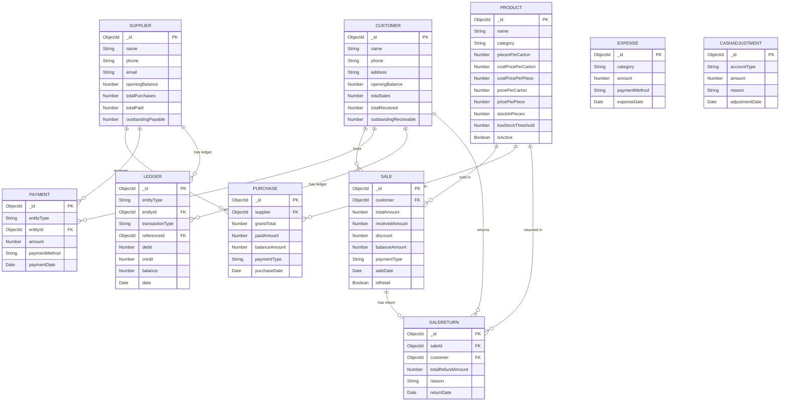

# Wholesale Management System — Deep Analysis
### Guddu Traders | Phase 3–14 Complete Documentation

---

## Phase 3 — Business Modules

### Module 1: Dashboard
| Field | Details |
|---|---|
| **Purpose** | Central command center — real-time snapshot of business health |
| **Features** | KPI cards (Sales, Profit, COGS, Expenses), Cash/Bank balance, Receivables, Payables, Low-stock alerts, Recent activity feed, Date filter, Cash adjustment |
| **Input** | Date range (start/end), Cash adjustment (amount, type, reason) |
| **Output** | Aggregated stats, activity list, low-stock product list |
| **Dependencies** | Reports API, Cash API, Sales, Purchases, Expenses, Customers, Suppliers, Products |
| **APIs Used** | `GET /api/reports/dashboard`, `GET /api/reports/activity`, `POST /api/cash/adjust`, `DELETE /api/cash/adjustments/:id` |
| **Business Importance** | ⭐⭐⭐⭐⭐ — First screen an owner sees; drives daily decisions |
| **Status** | ✅ Complete |

---

### Module 2: Inventory (Products)
| Field | Details |
|---|---|
| **Purpose** | Master product catalog + live stock tracking |
| **Features** | Add/Edit/Delete products, Manual stock adjustment, Low-stock alert badge, Active/Inactive toggle, Search, Category filter |
| **Input** | Product name, category, pieces-per-carton, cost price (carton + piece), sale price (carton + piece), customer product name, low-stock threshold |
| **Output** | Product list with live stock level, carton equivalent (virtual field) |
| **Dependencies** | None (standalone master data) |
| **APIs Used** | `GET /api/products`, `POST /api/products`, `PUT /api/products/:id`, `DELETE /api/products/:id`, `POST /api/products/:id/adjust` |
| **Business Importance** | ⭐⭐⭐⭐⭐ — Foundation for Sales and Purchases |
| **Status** | ✅ Complete. Note: No image upload, no barcode |

---

### Module 3: Sales
| Field | Details |
|---|---|
| **Purpose** | Record customer sales transactions with invoice generation |
| **Features** | Create/Edit/Delete sale, Wholesale + Retail modes, Multi-item sale, Cash/Credit payment, Discount, Invoice PDF (via html2canvas + jsPDF), Sale returns, Date filter |
| **Input** | Customer (optional), items (product, qty, unit, price), payment type, received amount, discount, date |
| **Output** | Sale record, stock deduction, customer ledger entry, invoice PDF |
| **Dependencies** | Customers, Products, Ledger |
| **APIs Used** | `GET /api/sales`, `POST /api/sales`, `PUT /api/sales/:id`, `DELETE /api/sales/:id`, `POST /api/returns` |
| **Business Importance** | ⭐⭐⭐⭐⭐ — Core revenue module |
| **Status** | ✅ Complete. Largest page (~831 lines / 48KB) |

---

### Module 4: Purchases
| Field | Details |
|---|---|
| **Purpose** | Record goods purchased from suppliers |
| **Features** | Create/Edit/Delete purchase, Multi-item, Supplier link, Cash/Credit, Stock increase, Cost price update, Date filter |
| **Input** | Supplier, items (product, qty, unit, purchase cost), payment type, paid amount, date |
| **Output** | Purchase record, stock increase, cost price update on product, supplier ledger entry |
| **Dependencies** | Suppliers, Products, Ledger |
| **APIs Used** | `GET /api/purchases`, `POST /api/purchases`, `PUT /api/purchases/:id`, `DELETE /api/purchases/:id` |
| **Business Importance** | ⭐⭐⭐⭐⭐ — Drives stock and COGS |
| **Status** | ✅ Complete |

---

### Module 5: Customers
| Field | Details |
|---|---|
| **Purpose** | Customer CRM + Accounts Receivable management |
| **Features** | Add/Edit/Delete customer, Opening balance, Outstanding balance display, Ledger view (per customer), Manual payment from ledger, PDF Statement download, Search |
| **Input** | Name, phone, address, opening balance |
| **Output** | Customer record, ledger entries, PDF account statement |
| **Dependencies** | Payments API, Ledger model, Sales, SaleReturns |
| **APIs Used** | `GET /api/customers`, `POST /api/customers`, `PUT /api/customers/:id`, `DELETE /api/customers/:id`, `GET /api/customers/:id/ledger`, `GET /api/customers/:id/statement` |
| **Business Importance** | ⭐⭐⭐⭐⭐ — Tracks credit customers and outstanding dues |
| **Status** | ✅ Complete |

---

### Module 6: Suppliers
| Field | Details |
|---|---|
| **Purpose** | Supplier management + Accounts Payable |
| **Features** | Add/Edit/Delete supplier, Opening balance, Outstanding payable, Ledger view, Manual payment from ledger, Delete purchase from ledger, PDF Statement |
| **Input** | Name, phone, email, address, opening balance |
| **Output** | Supplier record, ledger entries, PDF statement |
| **Dependencies** | Payments API, Purchases API, Ledger model |
| **APIs Used** | `GET /api/suppliers`, `POST /api/suppliers`, `PUT /api/suppliers/:id`, `DELETE /api/suppliers/:id`, `GET /api/suppliers/:id/ledger` |
| **Business Importance** | ⭐⭐⭐⭐⭐ — Tracks what business owes to suppliers |
| **Status** | ✅ Complete |

---

### Module 7: Payments
| Field | Details |
|---|---|
| **Purpose** | Standalone payment recording for customers and suppliers |
| **Features** | Record payment (Customer/Supplier), multiple payment methods (Cash, Bank, Cheque), Date filter, Delete payment with reversal |
| **Input** | Entity type (Customer/Supplier), entity ID, amount, method, date, note |
| **Output** | Payment record, balance update on entity, ledger entry |
| **Dependencies** | Customers, Suppliers, Ledger |
| **APIs Used** | `GET /api/payments`, `POST /api/payments`, `DELETE /api/payments/:id` |
| **Business Importance** | ⭐⭐⭐⭐ — Standalone payment without a sale/purchase |
| **Status** | ✅ Complete. No PUT (edit) — only delete + re-create |

---

### Module 8: Expenses
| Field | Details |
|---|---|
| **Purpose** | Track operational expenses (rent, fuel, utilities, salary, etc.) |
| **Features** | Add/Edit/Delete expense, Category-based, Date filter, Total sum display |
| **Input** | Category, amount, description, payment method, date |
| **Output** | Expense record (affects profit calculation) |
| **Dependencies** | None (standalone) |
| **APIs Used** | `GET /api/expenses`, `POST /api/expenses`, `PUT /api/expenses/:id`, `DELETE /api/expenses/:id` |
| **Business Importance** | ⭐⭐⭐⭐ — Needed for net profit calculation |
| **Status** | ✅ Complete. Note: No expense categories management (free text) |

---

### Module 9: Reports
| Field | Details |
|---|---|
| **Purpose** | Business analytics — Profit, Trends, Sales/Purchase details |
| **Features** | Profit & Loss report, 6-month trend chart (Bar + Line), Detailed transaction list (Sales/Purchases/Expenses/Payments/Returns), Date filter, Print |
| **Input** | Date range |
| **Output** | Profit summary, chart data, itemized detail list |
| **Dependencies** | Sales, Purchases, Expenses, Payments, SaleReturns |
| **APIs Used** | `GET /api/reports/profit`, `GET /api/reports/trends`, `GET /api/reports/sales`, `GET /api/reports/purchases` |
| **Business Importance** | ⭐⭐⭐⭐ — Business performance visibility |
| **Status** | ✅ Functional. Limitation: No customer-wise or product-wise report |

---

### Module 10: Daily Ledger
| Field | Details |
|---|---|
| **Purpose** | Day-by-day cash flow tracker (Cash In Hand + Cash In Bank) |
| **Features** | Opening/Closing balance per day, Money-in/Money-out breakdown, Date range filter, Collapsible day cards, Bank vs Cash separation |
| **Input** | Date range (from/to) |
| **Output** | Day-wise cash flow with opening and closing balances |
| **Dependencies** | Sales, Purchases, Payments, Expenses, CashAdjustments |
| **APIs Used** | `GET /api/reports/daily-ledger?from=&to=` |
| **Business Importance** | ⭐⭐⭐⭐⭐ — Daily cash management |
| **Status** | ✅ Complete |

---

### Module 11: Sale Returns
| Field | Details |
|---|---|
| **Purpose** | Handle goods returned by customers |
| **Features** | Create return linked to sale, stock reversal, customer balance credit, ledger entry |
| **Input** | Sale ID, returned items (product, qty, unit, price), refund amount, reason |
| **Output** | Return record, stock increase, customer outstanding reduced, ledger credit entry |
| **Dependencies** | Sales, Products, Customers, Ledger |
| **APIs Used** | `POST /api/returns`, `GET /api/returns`, `DELETE /api/returns/:id` |
| **Business Importance** | ⭐⭐⭐ — Important for wholesale business |
| **Status** | ⚠️ Backend complete. No dedicated frontend page — embedded in Sales page |

---

### Module 12: Cash Adjustment
| Field | Details |
|---|---|
| **Purpose** | Manually correct Cash or Bank balance (e.g., opening cash entry, petty cash) |
| **Features** | Add/Subtract from Cash or Bank, History view, Delete adjustment |
| **Input** | Account type (Cash/Bank), amount (+/-), reason |
| **Output** | Balance correction (reflected in Dashboard) |
| **Dependencies** | Dashboard |
| **APIs Used** | `POST /api/cash/adjust`, `GET /api/cash/adjustments`, `DELETE /api/cash/adjustments/:id` |
| **Business Importance** | ⭐⭐⭐ — Manual correction mechanism |
| **Status** | ✅ Embedded in Dashboard. No standalone page |

> **Missing Module**: ❌ Settings page — completely absent. No user preferences, no business profile configuration, no tax settings.

---

## Phase 4 — Database / Entity Relationship

### Entity: Customer
| Field | Type | Source |
|---|---|---|
| `_id` | ObjectId | Auto |
| `name` | String, required | Code Evidence |
| `phone` | String, required | Code Evidence |
| `address` | String | Code Evidence |
| `openingBalance` | Number, default 0 | Code Evidence |
| `totalSales` | Number, default 0 | Code Evidence (denormalized) |
| `totalReceived` | Number, default 0 | Code Evidence (denormalized) |
| `outstandingReceivable` | Number, default 0 | Code Evidence (denormalized) |
| `createdAt`, `updatedAt` | Date | Timestamps |

---

### Entity: Supplier
| Field | Type | Source |
|---|---|---|
| `_id` | ObjectId | Auto |
| `name` | String, required | Code Evidence |
| `phone` | String, required | Code Evidence |
| `contactPerson` | String | Code Evidence |
| `email` | String | Code Evidence |
| `address` | String | Code Evidence |
| `openingBalance` | Number, default 0 | Code Evidence |
| `totalPurchases` | Number, default 0 | Code Evidence (denormalized) |
| `totalPaid` | Number, default 0 | Code Evidence (denormalized) |
| `outstandingPayable` | Number, default 0 | Code Evidence (denormalized) |

---

### Entity: Product
| Field | Type | Source |
|---|---|---|
| `_id` | ObjectId | Auto |
| `name` | String, required | Code Evidence |
| `customerProductName` | String | Code Evidence (for invoices) |
| `category` | String | Code Evidence |
| `piecesPerCarton` | Number, required | Code Evidence |
| `costPricePerCarton` | Number, default 0 | Code Evidence |
| `costPricePerPiece` | Number, default 0 | Code Evidence |
| `lastPurchasePricePerCarton` | Number | Code Evidence |
| `lastPurchasePricePerPiece` | Number | Code Evidence |
| `pricePerCarton` | Number, required | Code Evidence |
| `pricePerPiece` | Number, required | Code Evidence |
| `stockInPieces` | Number, default 0 | Code Evidence |
| `lowStockThreshold` | Number, default 10 | Code Evidence |
| `isActive` | Boolean, default true | Code Evidence |
| `stockInCartons` | Virtual | Code Evidence |

---

### Entity: Sale
| Field | Type | Source |
|---|---|---|
| `_id` | ObjectId | Auto |
| `customer` | ObjectId → Customer (optional) | Code Evidence |
| `customerName` | String (guest) | Code Evidence |
| `items[]` | Array of embedded docs | Code Evidence |
| `items[].product` | ObjectId → Product | Code Evidence |
| `items[].quantity` | Number | Code Evidence |
| `items[].unit` | Enum: Carton / Piece | Code Evidence |
| `items[].costAtSale` | Number (snapshot) | Code Evidence |
| `items[].priceAtSale` | Number (snapshot) | Code Evidence |
| `items[].totalPrice` | Number | Code Evidence |
| `totalAmount` | Number | Code Evidence |
| `receivedAmount` | Number, default 0 | Code Evidence |
| `discount` | Number, default 0 | Code Evidence |
| `balanceAmount` | Number, default 0 | Code Evidence |
| `previousBalance` | Number, default 0 | Code Evidence |
| `paymentType` | Enum: Cash / Credit | Code Evidence |
| `saleDate` | Date | Code Evidence |
| `isRetail` | Boolean, default false | Code Evidence |

---

### Entity: Purchase
| Field | Type | Source |
|---|---|---|
| `_id` | ObjectId | Auto |
| `supplier` | ObjectId → Supplier, required | Code Evidence |
| `items[]` | Array | Code Evidence |
| `items[].product` | ObjectId → Product | Code Evidence |
| `items[].quantity` | Number | Code Evidence |
| `items[].unit` | Enum: Carton / Piece | Code Evidence |
| `items[].costAtPurchase` | Number (price per unit) | Code Evidence |
| `items[].totalCost` | Number | Code Evidence |
| `grandTotal` | Number | Code Evidence |
| `paidAmount` | Number, default 0 | Code Evidence |
| `balanceAmount` | Number | Code Evidence |
| `paymentType` | Enum: Cash / Credit | Code Evidence |
| `purchaseDate` | Date | Code Evidence |
| `referenceId` | String (external ref) | Code Evidence |

---

### Entity: Payment
| Field | Type | Source |
|---|---|---|
| `_id` | ObjectId | Auto |
| `entityType` | Enum: Customer / Supplier | Code Evidence |
| `entityId` | ObjectId → Customer or Supplier (polymorphic) | Code Evidence |
| `amount` | Number | Code Evidence |
| `paymentDate` | Date | Code Evidence |
| `paymentMethod` | Enum: Cash / Bank / Bank Transfer / Cheque / Other | Code Evidence |
| `note` | String | Code Evidence |

---

### Entity: Expense
| Field | Type | Source |
|---|---|---|
| `_id` | ObjectId | Auto |
| `category` | String (free text: rent, fuel, salary) | Code Evidence |
| `amount` | Number | Code Evidence |
| `description` | String | Code Evidence |
| `paymentMethod` | Enum: Cash / Bank Transfer / Cheque | Code Evidence |
| `expenseDate` | Date | Code Evidence |

---

### Entity: Ledger
| Field | Type | Source |
|---|---|---|
| `_id` | ObjectId | Auto |
| `entityType` | Enum: Customer / Supplier | Code Evidence |
| `entityId` | ObjectId → Customer or Supplier (polymorphic) | Code Evidence |
| `transactionType` | Enum: Sale / Purchase / Payment / Return | Code Evidence |
| `referenceId` | ObjectId → Sale / Purchase / Payment / Return | Code Evidence |
| `debit` | Number, default 0 | Code Evidence |
| `credit` | Number, default 0 | Code Evidence |
| `balance` | Number (running total) | Code Evidence |
| `description` | String | Code Evidence |
| `date` | Date | Code Evidence |

---

### Entity: SaleReturn
| Field | Type | Source |
|---|---|---|
| `_id` | ObjectId | Auto |
| `saleId` | ObjectId → Sale | Code Evidence |
| `customer` | ObjectId → Customer | Code Evidence |
| `items[].product` | ObjectId → Product | Code Evidence |
| `items[].quantity` | Number | Code Evidence |
| `items[].unit` | Enum: Carton / Piece | Code Evidence |
| `items[].priceAtReturn` | Number | Code Evidence |
| `totalRefundAmount` | Number | Code Evidence |
| `reason` | String | Code Evidence |
| `returnDate` | Date | Code Evidence |

---

### Entity: CashAdjustment
| Field | Type | Source |
|---|---|---|
| `_id` | ObjectId | Auto |
| `accountType` | Enum: Cash / Bank | Code Evidence |
| `amount` | Number (+/-) | Code Evidence |
| `reason` | String | Code Evidence |
| `adjustmentDate` | Date | Code Evidence |

---

### ER Diagram



---

## Phase 5 — Customer Logic (Deep Analysis)

### Customer Creation Flow
```
User fills: name, phone, address, openingBalance
    ↓
POST /api/customers
    ↓
Controller: outstandingReceivable = openingBalance
    ↓
Customer saved in DB
    ↓
⚠️ NO Ledger entry on creation (opening balance only in Customer document)
```

### Sale → Customer Flow
```
Sale Created (Credit or partial payment)
    ↓
balanceAmount = totalAmount - discount - receivedAmount
    ↓
IF no customer AND (balanceAmount > 0 OR saveAsCustomer):
    Auto-create Customer ("Walk-in Customer")
    ↓
Customer.totalSales    += (totalAmount - discount)
Customer.totalReceived += receivedAmount
Customer.outstandingReceivable += balanceAmount
    ↓
Ledger Entry 1: DEBIT (totalAmount - discount)  → "Sale"
Ledger Entry 2: CREDIT (receivedAmount)         → "Payment" [if receivedAmount > 0]
```

### Payment → Customer Flow
```
POST /api/payments  {entityType: 'Customer', entityId, amount}
    ↓
Customer.totalReceived += amount
Customer.outstandingReceivable -= amount
    ↓
Ledger Entry: CREDIT (amount) → "Payment"
```

### Sale Return → Customer Flow
```
POST /api/returns {saleId, items, totalRefundAmount}
    ↓
Stock increased (returned items)
    ↓
Customer.outstandingReceivable -= totalRefundAmount
    ↓
Ledger Entry: CREDIT (totalRefundAmount) → "Return"
```

### Customer Ledger Calculation
```
Running Balance Formula (Customer):
    newBalance = previousBalance + debit - credit

Where:
    debit  = Sale amount (increases what customer owes)
    credit = Payment or Return (decreases what customer owes)
```

### Outstanding Receivable Formula
```
Customer.outstandingReceivable = openingBalance + totalSales - totalReceived

(Denormalized — stored directly on Customer document)
```

### PDF Statement Generation
```
Statement Period: 1 Jun 2026 to present (HARDCODED)
    ↓
Opening Balance = currentOutstanding - periodBills + periodPayments + periodReturns
    ↓
Rows: All Sales + Payments + Returns in period, sorted by date
    ↓
Running Balance recalculated row by row:
    SALE:    balance += netAmount (totalAmount - discount)
    PAYMENT: balance -= paymentAmount
    RETURN:  balance -= refundAmount
    ↓
Footer: Opening Balance | Total Bills | Total Received | Current Outstanding
```

> [!WARNING]
> **Hidden Bug**: Statement FROM_DATE is hardcoded as `new Date('2026-06-01')` in customerController.js line 121. This is not dynamic — all customers see June 2026 as statement start regardless of when they were created.

### Customer Flow Diagram
```
[Create Customer] ──────────────────────────────────────────────┐
                                                                 ↓
[Make Sale] → Stock↓ → Customer.outstandingReceivable↑ → [Ledger: DEBIT]
                                                                 ↓
[Receive Payment] → Customer.outstandingReceivable↓ ──── [Ledger: CREDIT]
                                                                 ↓
[Sale Return] → Stock↑ → Customer.outstandingReceivable↓ ─ [Ledger: CREDIT]
                                                                 ↓
[View Ledger] → All entries sorted by date → Running balance shown
                                                                 ↓
[Download PDF] → Statement generated server-side (PDFKit) → Browser download
```

---

## Phase 6 — Supplier Logic (Deep Analysis)

### Supplier Creation
```
POST /api/suppliers
    ↓
Supplier.outstandingPayable = openingBalance
    ↓
⚠️ NO Ledger entry on creation
```

### Purchase → Supplier Flow
```
POST /api/purchases
    ↓
grandTotal = sum of all items' totalCost
balanceAmount = grandTotal - paidAmount
    ↓
Supplier.totalPurchases += grandTotal
Supplier.totalPaid += paidAmount
Supplier.outstandingPayable += balanceAmount
    ↓
Ledger Entry 1: CREDIT (grandTotal) → "Purchase" [increases payable]
Ledger Entry 2: DEBIT (paidAmount)  → "Payment"  [decreases payable, if paidAmount > 0]
```

### Supplier Ledger Calculation
```
Running Balance Formula (Supplier):
    newBalance = previousBalance + credit - debit

Where:
    credit = Purchase amount (increases what business owes)
    debit  = Payment (decreases what business owes)
```

### Outstanding Payable Formula
```
Supplier.outstandingPayable = openingBalance + totalPurchases - totalPaid
```

### Payment to Supplier Flow
```
POST /api/payments  {entityType: 'Supplier', entityId, amount}
    ↓
Supplier.totalPaid += amount
Supplier.outstandingPayable -= amount
    ↓
Ledger Entry: DEBIT (amount) → "Payment"
```

### Supplier Update Formula
```
On PUT /api/suppliers/:id:
    outstandingPayable = openingBalance + totalPurchases - totalPaid
    (Recalculated from scratch on every update)
```

### Hidden Business Rules (Supplier)
1. **Ledger persists after supplier update** — updating supplier info recalculates balance from denormalized fields, not from Ledger
2. **Delete supplier → deletes ALL ledger** — no protection against deletion with outstanding balance
3. **Supplier PDF statement** — uses `jsPDF` on the frontend (not PDFKit server-side), so format is simpler
4. **Opening Balance** — set once at creation, cannot be changed without affecting payable recalculation
5. **Purchase delete from Supplier Ledger page** — allowed directly without going to Purchases module

---

## Phase 7 — Inventory Logic

### Stock Increase (Purchase)
```
Purchase Created → For each item:
    IF unit == 'Carton': piecesToAdd = quantity × piecesPerCarton
    IF unit == 'Piece':  piecesToAdd = quantity
    Product.stockInPieces += piecesToAdd
```

### Stock Decrease (Sale)
```
Sale Created → For each item:
    IF unit == 'Carton': piecesToReduce = quantity × piecesPerCarton
    IF unit == 'Piece':  piecesToReduce = quantity
    Product.stockInPieces -= piecesToReduce
    ⚠️ NO check if stock goes negative — can go to -ve
```

### Stock Increase (Sale Return)
```
Return Created → For each item:
    piecesToAdd = quantity × piecesPerCarton (if Carton) else quantity
    Product.stockInPieces += piecesToAdd
```

### Stock Reversal (Delete Sale/Purchase)
- Delete Sale → Stock is added back for each item
- Delete Purchase → Stock is reduced (with average cost recalculation attempt)
- Delete Return → Stock is reduced again

### Manual Stock Adjustment
```
POST /api/products/:id/adjust  { adjustment: N }
    Product.stockInPieces += N  (N can be negative)
    ⚠️ No reason stored in DB — only shown in frontend form but not saved
```

### Inventory Valuation — Cost Method
```
Method: LATEST PURCHASE PRICE (not FIFO, not Weighted Average)

On every NEW purchase:
    product.costPricePerPiece   = newCostPerPiece (from this purchase)
    product.costPricePerCarton  = newCostPerPiece × piecesPerCarton

This means: previous purchase cost is OVERWRITTEN every time a new purchase arrives.

costAtSale is SNAPSHOT at time of sale (correct for historical profit calc).
```

### COGS Calculation
```
At time of sale:
    costAtSale = current product.costPricePerCarton (or piece)
    Stored as snapshot in Sale.items[].costAtSale

COGS per item = costAtSale × quantity

Total COGS = Σ(costAtSale × quantity) for all items in sale
```

### Low Stock Alert
```
Query: Product.stockInPieces <= Product.lowStockThreshold
    → Shows badge count on Dashboard
    → Shows warning icon in Inventory list
```

### Inventory Weaknesses
- ❌ No damage/wastage module
- ❌ Negative stock allowed (no guard)
- ❌ No stock history / audit trail
- ❌ Adjustment reason not stored in DB
- ❌ No FIFO or Weighted Average — only latest price

---

## Phase 8 — Sales Logic

### Sale Creation Flow
```
Step 1: User selects customer (optional) OR enters guest info
Step 2: Add items (product, qty, unit [Carton/Piece], price auto-filled)
Step 3: Select payment type (Cash / Credit)
Step 4: Enter received amount + discount (optional)
Step 5: Submit
    ↓
Server calculates:
    totalAmount    = Σ(item.totalPrice)
    balanceAmount  = totalAmount - discount - receivedAmount
    ↓
If no customer AND (balance > 0 OR saveAsCustomer flag):
    → Auto-create new Customer
    ↓
Save Sale document
    ↓
For each item: Product.stockInPieces -= piecesInSale
    ↓
If customer exists:
    Customer.totalSales += (totalAmount - discount)
    Customer.totalReceived += receivedAmount
    Customer.outstandingReceivable += balanceAmount
    Ledger DEBIT: (totalAmount - discount)
    Ledger CREDIT: receivedAmount (if > 0)
    ↓
Return saved Sale
```

### Invoice Generation (Client-side)
```
html2canvas captures the invoice HTML div
jsPDF converts canvas to PDF
Download / Share / Print triggered in browser

Invoice shows:
- Customer name, date
- Items table (product name from customerProductName if set)
- Subtotal, Discount, Net Amount
- Received, Balance
- Previous Balance (shown on invoice)
```

### Retail vs Wholesale Mode
```
isRetail = true  → Guest sale, no customer account required
isRetail = false → Linked to customer account, updates ledger

Toggle in UI changes the form behavior
```

### Sale Edit Flow
```
1. Revert original stock (add back)
2. Revert original customer totals (subtract)
3. Recalculate new totals + costs
4. Apply new stock changes (reduce)
5. Update customer totals + add new ledger entries
6. Save updated Sale
⚠️ OLD ledger entries are NOT deleted — new ones added on top of old ones
   This causes DUPLICATE entries in ledger on edit!
```

### Sale Delete Flow
```
1. Add stock back for all items
2. Revert customer.totalSales, totalReceived, outstandingReceivable
3. Delete ALL Ledger entries with referenceId = sale._id
4. Delete Sale
✅ Clean reversal
```

### Sale Flowchart
```
[User] → Select Customer (or Guest)
       → Add Items (Product, Qty, Unit, Price)
       → Set Payment Type
       → Enter Received + Discount
       → SUBMIT
            ↓
       [Server] → Calculate totals
                → Auto-create customer if needed
                → Deduct stock for each product
                → Update customer balance
                → Write 2 Ledger entries (Sale + Payment)
                → Return Sale doc
            ↓
       [UI] → Show success modal
            → Generate Invoice PDF (client-side)
            → Option: Print / Download / Share
```

---

## Phase 9 — Purchase Logic

### Purchase Creation Flow
```
Step 1: Select Supplier
Step 2: Add items (product, qty, unit, cost price per unit)
Step 3: Payment type + paid amount
Step 4: Date
Step 5: Submit
    ↓
grandTotal = Σ(item.totalCost)
balanceAmount = grandTotal - paidAmount
    ↓
Save Purchase
    ↓
For each item:
    newQtyPieces = qty × piecesPerCarton (if Carton) else qty
    newCostPerPiece = costAtPurchase / piecesPerCarton (if Carton) else costAtPurchase
    
    Product.costPricePerPiece   = newCostPerPiece   ← OVERWRITES
    Product.costPricePerCarton  = newCostPerPiece × ppc
    Product.lastPurchasePricePerCarton = same
    Product.lastPurchasePricePerPiece  = same
    Product.stockInPieces += newQtyPieces
    ↓
Supplier.totalPurchases += grandTotal
Supplier.totalPaid += paidAmount
Supplier.outstandingPayable += balanceAmount
    ↓
Ledger CREDIT: grandTotal  → "Purchase"
Ledger DEBIT: paidAmount   → "Payment" (if > 0)
```

### Purchase Edit Flow
```
1. Revert old stock (subtract pieces)
2. Revert old supplier totals (subtract)
3. Recalculate new grandTotal
4. Apply new stock + overwrite cost price
5. Update supplier totals
6. Add new ledger entries (old ones NOT deleted → duplicate ledger risk)
7. Save Purchase
```

### Purchase Delete Flow
```
1. Revert stock (subtract qty pieces)
   + Attempt average cost recalculation:
       newQty = currentStock - removedQty
       if newQty > 0:
           newCost = (currentStock × currentCostPerPiece - removedValue) / newQty
           → Sets new average cost
2. Revert supplier totals
3. Delete all Ledger entries with referenceId = purchase._id
4. Delete Purchase
```

### Business Rules (Purchase)
1. Cost price is always **overwritten** on new purchase — no price history
2. A `referenceId` string field exists for external reference numbers (optional)
3. No invoice or receipt generation for purchases
4. Partial payment on purchase creates supplier balance automatically

---

## Phase 10 — Financial Logic

### Cash In Hand Calculation
```
Formula:
Cash In Hand = 
    (Cash Sales received) 
    + (Customer Cash Payments) 
    + (Cash Adjustments for 'Cash')
    - (Cash Purchases paid)
    - (Supplier Cash Payments)
    - (Cash Expenses)
```

### Cash In Bank Calculation
```
Formula:
Cash In Bank = 
    (Customer Bank/Cheque Payments received)
    + (Bank Adjustments)
    - (Supplier Bank/Cheque Payments)
    - (Bank/Cheque Expenses)
```

### Total Receivable
```
Total Receivable = Σ(Customer.outstandingReceivable) for all customers
```

### Total Payable
```
Total Payable = Σ(Supplier.outstandingPayable) for all suppliers
```

### Net Position
```
Net Position = Total Receivable - Total Payable
(If positive: business is owed more than it owes)
```

### Gross Profit
```
Gross Profit = Total Sales Revenue - Total COGS

Where:
    Total Sales Revenue = Σ(Sale.totalAmount)
    Total COGS = Σ(item.costAtSale × item.quantity) for all sale items
```

### Net Profit
```
Net Profit = Gross Profit - Total Expenses

Formula:
Net Profit = (Total Sales - COGS) - Σ(Expense.amount)
```

### Business Example
```
Sales: PKR 100,000
COGS: PKR 70,000
Gross Profit: PKR 30,000 (30% margin)
Expenses (rent, fuel): PKR 5,000
Net Profit: PKR 25,000
```

### Daily Cash Flow (Per Day)
```
Opening Cash = Closing Cash of previous day
    +  Cash Sales received today
    +  Customer Cash Payments today
    +  Cash Adjustments today
    -  Cash Purchases paid today
    -  Supplier Cash Payments today
    -  Cash Expenses today
= Closing Cash today
```

### Opening Balance Impact
```
Customer Opening Balance: Immediately added to outstandingReceivable
Supplier Opening Balance: Immediately added to outstandingPayable
→ These represent pre-existing dues before the system was deployed
```

---

## Phase 11 — Reports Analysis

### Report 1: Dashboard Stats (`GET /api/reports/dashboard`)
| | |
|---|---|
| **Purpose** | Real-time business snapshot for a date range |
| **Data Sources** | Sale, Purchase, Expense, Customer, Supplier, Product, Payment, CashAdjustment |
| **Filters** | startDate, endDate |
| **Calculations** | todaySales, todayCOGS, todayExpenses, todayProfit, totalReceivable, totalPayable, netPosition, cashInHand, cashInBank, lowStockCount |
| **Limitations** | Low-stock only shows first 5 products; `debugInfo` array is returned to client (security issue) |
| **Future Improvement** | Remove debugInfo; add product-wise profit breakdown |

### Report 2: Profit Report (`GET /api/reports/profit`)
| | |
|---|---|
| **Purpose** | P&L for a date range |
| **Data Sources** | Sale, Expense, Product (for cost fallback) |
| **Filters** | startDate, endDate |
| **Calculations** | totalSales, totalCOGS, grossProfit, totalExpenses, netProfit |
| **Limitations** | If costAtSale=0, falls back to current product cost (inaccurate for old sales); no discount deducted from totalSales in this report |
| **Future Improvement** | Deduct discounts; handle cost-zero products better |

### Report 3: Sales Report (`GET /api/reports/sales`)
| | |
|---|---|
| **Purpose** | List of all sales in date range |
| **Data Sources** | Sale (populated with Customer + Product) |
| **Filters** | startDate, endDate |
| **Sorting** | saleDate descending |
| **Limitations** | No grouping by customer, product, or category |

### Report 4: Purchase Report (`GET /api/reports/purchases`)
| | |
|---|---|
| **Purpose** | List of all purchases in date range |
| **Data Sources** | Purchase (populated with Supplier + Product) |
| **Filters** | startDate, endDate |
| **Sorting** | purchaseDate descending |
| **Limitations** | No product-wise purchase analysis |

### Report 5: Trends (`GET /api/reports/trends`)
| | |
|---|---|
| **Purpose** | 6-month revenue and expense bar/line chart |
| **Data Sources** | Sale, Expense (MongoDB aggregation) |
| **Filters** | None (always last 6 months) |
| **Grouping** | Monthly (YYYY-MM format) |
| **Limitations** | Fixed 6-month window; no custom range; no purchase trend |

### Report 6: Recent Activity (`GET /api/reports/activity`)
| | |
|---|---|
| **Purpose** | Latest transactions feed on Dashboard |
| **Data Sources** | Ledger (populated with entity) |
| **Filters** | startDate, endDate |
| **Sorting** | date descending |
| **Limitations** | Hard limit of 10 records; only Ledger transactions shown (no expenses) |

### Report 7: Daily Ledger (`GET /api/reports/daily-ledger`)
| | |
|---|---|
| **Purpose** | Day-by-day cash flow with opening/closing balances |
| **Data Sources** | Sale, Purchase, Payment, Expense, CashAdjustment |
| **Filters** | from, to (date range) |
| **Calculations** | Per-day: moneyIn, moneyOut, cashIn, bankIn, cashOut, bankOut, openingCash, closingCash, openingBank, closingBank |
| **Limitations** | Default from date is hardcoded as '2026-06-15'; N+1 query problem (one DB query per day) |
| **Future Improvement** | Use aggregation pipeline instead of per-day queries |

---

## Phase 12 — Hidden Business Rules

### Credit Sales
- A credit sale with `balanceAmount > 0` automatically links to a customer
- If no customer selected and balance > 0 → a new customer is **auto-created** with name "Walk-in Customer"
- `previousBalance` field on Sale is stored (shown on invoice) but not used in calculations — purely for display

### Advance Payments
- Paying more than the invoice amount? → `balanceAmount` becomes negative → `outstandingReceivable` decreases below zero
- System allows negative outstanding — represents customer advance/credit
- No explicit "advance" state flag — hidden in negative outstanding

### Sale Returns
- Returns only work for registered customers (non-guest)
- Return reduces outstanding but does NOT affect `totalSales` on Customer
- Multiple returns can be made against a single sale — no total refund cap enforcement

### Inventory Rules (Hidden)
- Stock can go negative — no guard in backend
- Manual adjustment has no reason stored in DB (only in UI form)
- Deleting a purchase recalculates cost price (average) but deleting a sale does NOT recalculate cost
- Product `isActive` flag exists but there is no "deactivate" button in UI — only delete

### Cash Rules
- Cash Sales only count `receivedAmount` towards Cash In Hand (not total sale)
- Credit sales with advance (`receivedAmount > 0, paymentType = 'Credit'`) → advance counted as Cash In
- Cash adjustments can go negative (subtract cash)
- Bank methods: `['Bank', 'Bank Transfer', 'Cheque']` all treated equally

### Expense Rules
- Expenses are never linked to a supplier — standalone records
- Category is free text (no category enum) — inconsistent data possible
- Expenses reduce cash/bank balance in calculations but have no ledger entry
- An expense deleted does not create a reversal entry — just removed

### Profit Rules
- **Discounts** ARE deducted from totalSales in ledger (correct), but in `getProfitReport`, `totalSales` uses raw `sale.totalAmount` (without discount deduction) → overstated revenue
- If a product has `costAtSale = 0` (old data), system falls back to current product cost → profit may be wrong for historical records

### Supplier Opening Balance
- Opening balance = what the business ALREADY OWED the supplier before software started
- Setting opening balance → immediately increases `outstandingPayable`
- No ledger entry created for opening balance → ledger balance starts from 0 but document balance starts from opening

---

## Phase 13 — Architecture Weaknesses & Solutions

### 1. No Authentication
| | |
|---|---|
| **Issue** | Zero auth — any URL access gives full system access |
| **Risk** | Critical — any person with the backend URL can read/delete all data |
| **Solution** | Add JWT auth with bcrypt-hashed password. Simple single-user PIN login for this business |

### 2. Duplicate Ledger on Edit
| | |
|---|---|
| **Issue** | Sale/Purchase edit does NOT delete old ledger entries — adds new ones |
| **Risk** | Ledger becomes inaccurate over time after any edit |
| **Solution** | `await Ledger.deleteMany({ referenceId: originalId })` before adding new entries |

### 3. N+1 Query in Daily Ledger
| | |
|---|---|
| **Issue** | `getDailyLedger` runs multiple DB queries for EACH day in range |
| **Risk** | Performance degrades with large date ranges (30-day range = 30×7 = 210 queries) |
| **Solution** | Use MongoDB `$group` with `$dateToString` aggregation for bulk data fetch |

### 4. Denormalized Balance Fields
| | |
|---|---|
| **Issue** | `Customer.outstandingReceivable`, `totalSales`, `totalReceived` are denormalized and updated manually |
| **Risk** | If a bug skips an update, balances drift silently. Data inconsistency |
| **Solution** | Add a reconciliation job that recalculates balances from Ledger periodically |

### 5. debugInfo in API Response
| | |
|---|---|
| **Issue** | `getDashboardStats` returns `debugInfo` with cost details to the client |
| **Risk** | Exposes internal cost structure — security + performance issue |
| **Solution** | Remove `debugInfo` from response payload (keep server-side console.log only) |

### 6. Hardcoded Statement Date
| | |
|---|---|
| **Issue** | PDF statement start date is hardcoded: `new Date('2026-06-01')` |
| **Risk** | Statements are wrong for any customer before June 2026; will break every year |
| **Solution** | Accept `fromDate` query param in `getCustomerPDFStatement` |

### 7. No Input Validation
| | |
|---|---|
| **Issue** | Backend controllers use `req.body` directly with minimal validation |
| **Risk** | Bad data (negative amounts, missing fields) can corrupt balances |
| **Solution** | Add Joi or Zod validation middleware on all mutation routes |

### 8. Negative Stock Allowed
| | |
|---|---|
| **Issue** | No check if `product.stockInPieces` would go negative after sale |
| **Risk** | Phantom stock; inventory report becomes unreliable |
| **Solution** | Add guard: `if (product.stockInPieces < piecesToReduce) throw new Error('Insufficient stock')` |

### 9. Category Free Text (Expenses)
| | |
|---|---|
| **Issue** | Expense category is a free-text string — no enum or lookup |
| **Risk** | Same expense shows as "Fuel", "fuel", "FUEL" — report grouping breaks |
| **Solution** | Create ExpenseCategory collection or use a defined enum |

### 10. No Pagination on List APIs
| | |
|---|---|
| **Issue** | `GET /api/sales` returns ALL records for the date range — no limit |
| **Risk** | With thousands of sales, response can be huge; browser freezes |
| **Solution** | Add `page` and `limit` query params with MongoDB `.skip().limit()` |

### 11. No Error Boundary in React
| | |
|---|---|
| **Issue** | No React Error Boundary component wrapping pages |
| **Risk** | If one page crashes, entire app goes blank |
| **Solution** | Wrap `<Outlet>` in `<ErrorBoundary>` component |

### 12. Duplicate API Calls
| | |
|---|---|
| **Issue** | Customers list fetched separately in Sales, Payments, and Customers pages — no caching |
| **Risk** | Extra network calls; stale data between pages |
| **Solution** | Add React Query or SWR for request deduplication and caching |

---

## Phase 14 — Missing ERP Features (Wholesale ERP Roadmap)

| Priority | Feature | Why Missing | Effort |
|---|---|---|---|
| 🔴 P0 | **Authentication & Login** | No auth at all | Low |
| 🔴 P0 | **Settings / Business Profile** | Hardcoded business name & dates | Low |
| 🔴 P0 | **Input Validation** | No server-side validation | Low |
| 🟠 P1 | **Customer-wise Sales Report** | No product/customer grouping | Medium |
| 🟠 P1 | **Product-wise Sales Report** | No top-selling product analysis | Medium |
| 🟠 P1 | **Expense Categories Management** | Free-text categories | Low |
| 🟠 P1 | **Stock History / Audit Trail** | No movement log | Medium |
| 🟠 P1 | **Pagination on all Lists** | Unbounded list queries | Low |
| 🟡 P2 | **Purchase Invoice/Receipt** | No PDF for purchases | Medium |
| 🟡 P2 | **Damage / Wastage Module** | No way to write off stock | Medium |
| 🟡 P2 | **Multi-User / Role-Based Access** | No user management | High |
| 🟡 P2 | **Audit Logs** | No action history | Medium |
| 🟡 P2 | **Cash Register / Till** | No POS-style interface | High |
| 🟡 P2 | **Payroll** | No employee salary management | High |
| 🟢 P3 | **Tax / GST Management** | No tax handling at all | High |
| 🟢 P3 | **Warehouse / Location Management** | Single-location only | High |
| 🟢 P3 | **Multiple Branches** | Single business only | High |
| 🟢 P3 | **Approval Workflow** | No approve/reject flow | High |
| 🟢 P3 | **Capital / Investor Management** | No equity tracking | High |
| 🟢 P3 | **Profit Distribution** | No partner profit share | High |
| 🟢 P3 | **Business Reserve Fund** | No reserve accounting | High |
| 🟢 P3 | **Fixed Assets Management** | No vehicle/equipment tracking | High |
| 🟢 P3 | **Forecasting / Analytics** | No ML/trend prediction | Very High |
| 🟢 P3 | **Barcode / QR Scanning** | Manual product entry only | Medium |
| 🟢 P3 | **WhatsApp / SMS Notifications** | No automated messages | Medium |
| 🟢 P3 | **Bank Reconciliation** | No bank statement import | High |
| 🟢 P3 | **Balance Sheet / Trial Balance** | No formal accounting statements | High |

### Priority Legend
- 🔴 P0 = Fix immediately (blocking bugs or critical security)
- 🟠 P1 = Next sprint (core business needs)
- 🟡 P2 = Next quarter (growth features)
- 🟢 P3 = Future roadmap (enterprise/scale features)

---

*Documentation generated: 2026-07-09 | Analysis by Antigravity AI*
