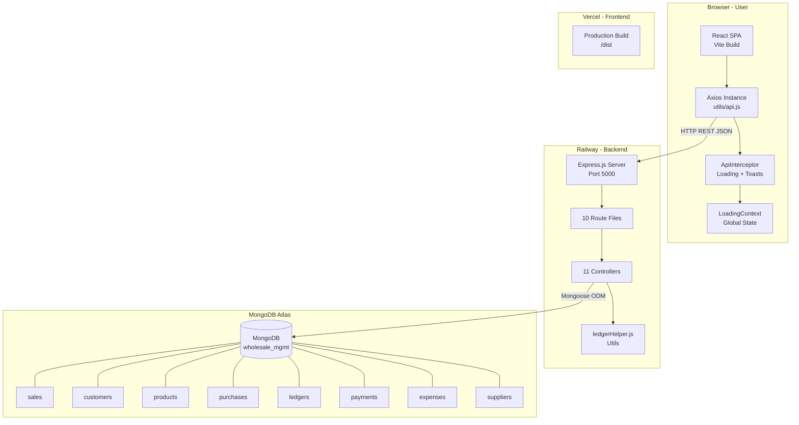
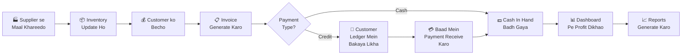
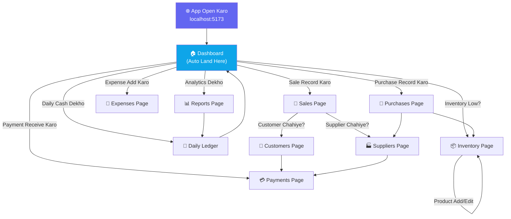
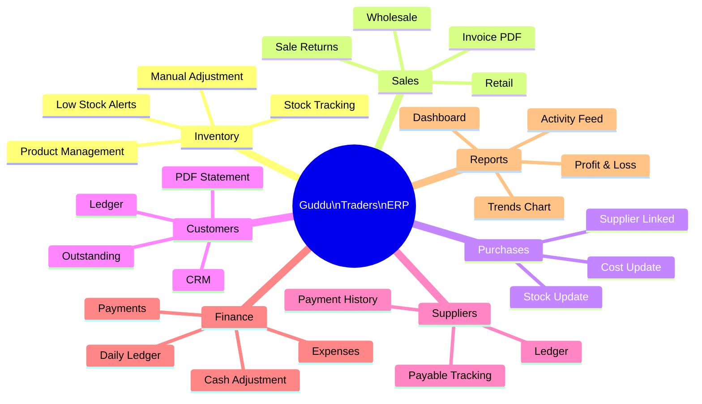
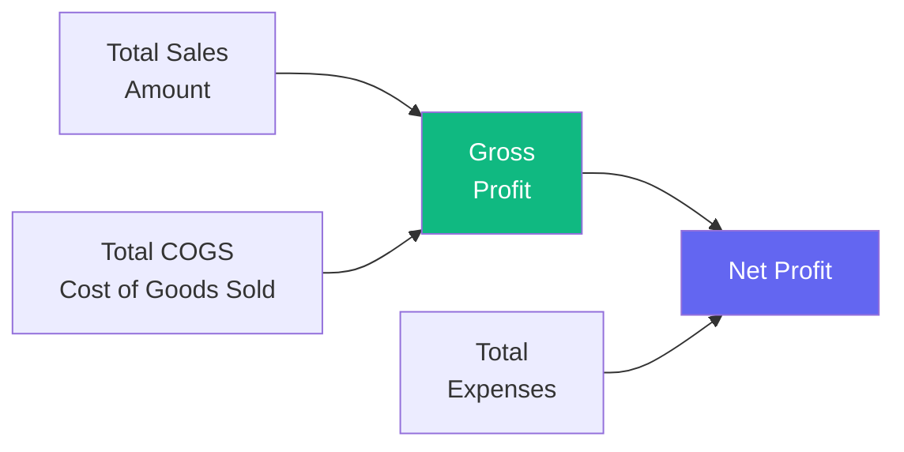
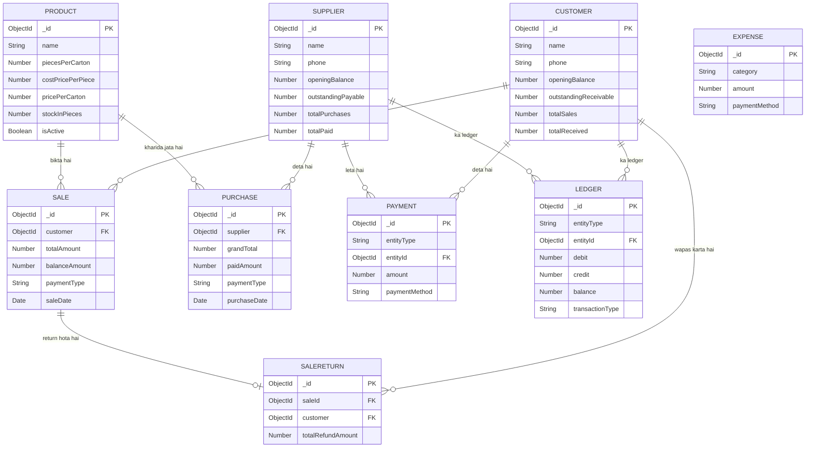
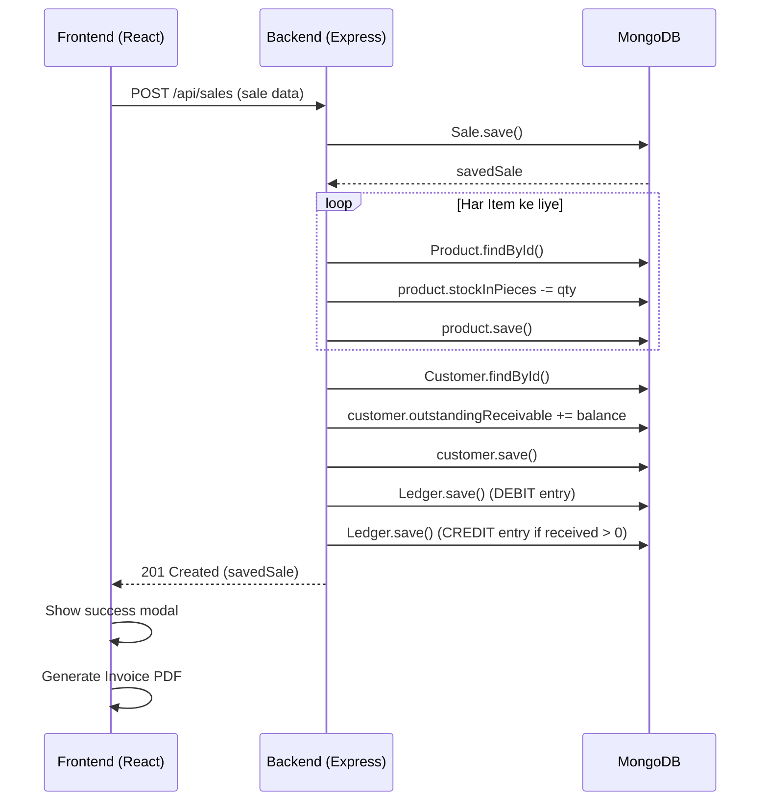
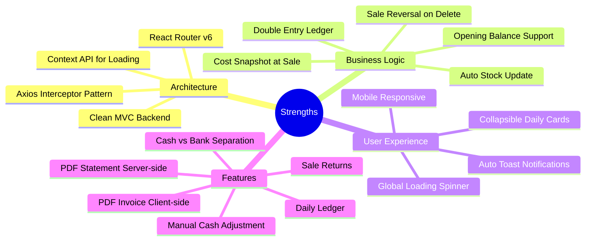
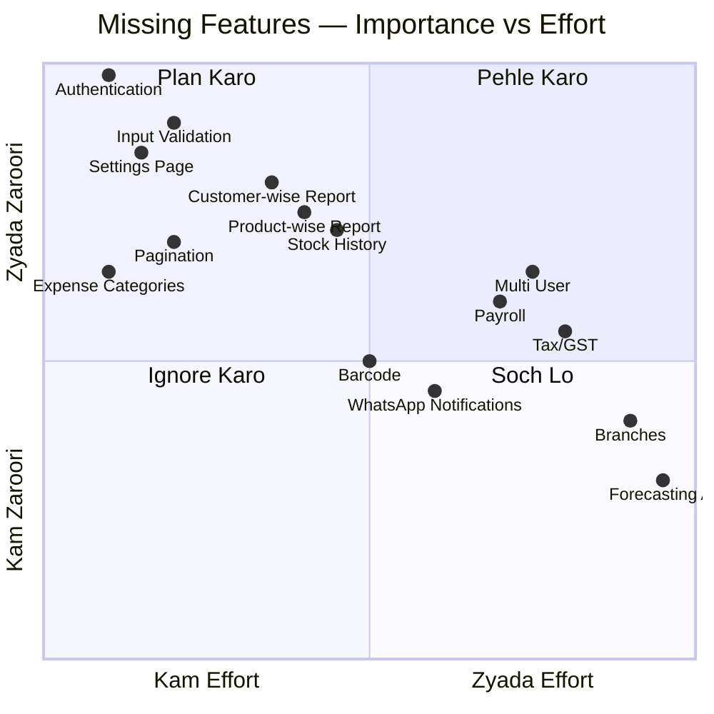
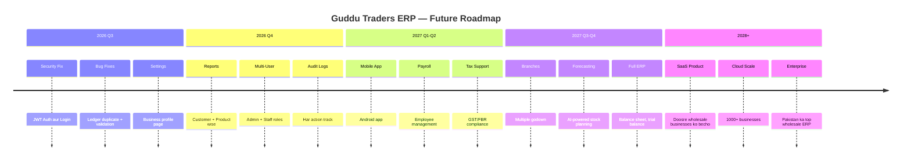

# Guddu Traders — Wholesale Management System
## Final Consultant Presentation
### Roman Urdu | Professional Analysis | July 2026

---
> *"Ye document ek senior software consultant ki taraf se likha gaya hai jo is poore project ko pehli baar dekh raha ho aur management ko brief kar raha ho."*
---

## 📋 Table of Contents

1. Executive Summary
2. Architecture Overview
3. Business Flow
4. Module-wise Analysis
5. Financial Calculations
6. Database & ER Diagram
7. Reports Analysis
8. Strengths
9. Weaknesses & Solutions
10. Missing ERP Features
11. ERP Roadmap
12. Conclusion
13. Future Vision

---

## 1. Executive Summary

### Project ka Overview

**Guddu Traders Wholesale Management System** ek internal business management software hai jo ek cold drink wholesale company ke liye banaya gaya hai. Is system ka maqsad manual register-keeping ko digital banana aur business operations ko streamline karna hai.

| Item | Detail |
|---|---|
| **Business Name** | Guddu Traders |
| **Business Type** | Cold Drink Wholesale |
| **Software Type** | Internal ERP (Single User) |
| **Deployment** | Railway (Backend) + Vercel (Frontend) |
| **Database** | MongoDB Atlas (Cloud) |
| **Currency** | PKR (Pakistani Rupee) |
| **Language Support** | English UI |
| **Authentication** | ❌ Koi auth nahi |

### Is Presentation ka Maqsad

Ye presentation management ko ye samjhana chahti hai ke:

- **Kya bana hai** — modules, features, calculations
- **Kaisa bana hai** — architecture, database, APIs
- **Kya theek hai** — strengths
- **Kya galat hai** — bugs, weaknesses, security issues
- **Aage kya karna chahiye** — roadmap, missing features

---

## 2. Architecture Overview

### Technology Stack

````carousel
### Frontend Stack

| Technology | Version | Role |
|---|---|---|
| **React 18** | 18.2.0 | UI Framework |
| **Vite** | 5.1.4 | Build Tool |
| **React Router DOM** | 6.22.1 | Page Navigation |
| **Axios** | 1.6.2 | API Communication |
| **Chart.js** | 4.4.1 | Analytics Charts |
| **Lucide React** | 0.321.0 | Icons |
| **react-hot-toast** | 2.6.0 | Notifications |
| **jsPDF + html2canvas** | Latest | PDF Generation |
| **Cypress** | 13.6.0 | E2E Testing |

<!-- slide -->
### Backend Stack

| Technology | Version | Role |
|---|---|---|
| **Node.js** | Latest | Runtime |
| **Express.js** | 4.18.2 | Web Framework |
| **MongoDB** | Atlas | Database |
| **Mongoose** | 8.3.2 | ODM |
| **PDFKit** | 0.19.1 | Server-side PDF |
| **Google Gemini AI** | 0.24.1 | AI Integration (partial) |
| **dotenv** | 16.3.1 | Environment Config |
| **cors** | 2.8.5 | Cross-Origin Support |

<!-- slide -->
### Infrastructure

| Item | Detail |
|---|---|
| **Backend Host** | Railway.app |
| **Frontend Host** | Vercel |
| **Database** | MongoDB Atlas (Cloud) |
| **CORS** | Vercel + localhost allowed |
| **Environment** | `.env` file with MONGO_URI, FRONTEND_URL |
| **API Base** | `http://127.0.0.1:5000/api` (dev) |
````

### System Architecture Diagram



### Pattern: MVC Architecture
```
Frontend (React) → Backend (Express MVC) → Database (MongoDB)
     View              Controller + Model         Data
```

---

## 3. Business Flow

### System ka Overall Business Cycle



### Navigation Flow (User Journey)



### Typical Daily Workflow (Subah se Sham tak)

| Time | Action | Module |
|---|---|---|
| **Subah** | Dashboard kholein, aaj ka status dekhin | Dashboard |
| **Din mein** | Customer aaya, sale record karo | Sales |
| **Din mein** | Supplier se maal aaya, purchase karo | Purchases |
| **Din mein** | Customer ne paise diye, payment record karo | Payments / Customers |
| **Din mein** | Bijli bill diya, expense add karo | Expenses |
| **Sham** | Aaj ka profit check karo | Dashboard / Reports |
| **Raat** | Daily Ledger dekho, cash count karo | Daily Ledger |

---

## 4. Module-wise Analysis

### Module Map



### Har Module ka Quick Summary

````carousel
### 📦 Module 1: Inventory

**Maqsad:** Products ka master record aur live stock tracking

**Kya karta hai:**
- ✅ Product add / edit / delete
- ✅ Cost price (carton + piece)
- ✅ Sale price (carton + piece)
- ✅ Stock automatically update on sale/purchase
- ✅ Low stock alert (threshold-based)
- ✅ Manual stock adjustment
- ❌ Stock negative ho sakta hai — koi rok nahi
- ❌ Damage/wastage entry nahi

**Business Importance:** ⭐⭐⭐⭐⭐

<!-- slide -->
### 🛒 Module 2: Sales

**Maqsad:** Customer ko maal bechne ka record

**Kya karta hai:**
- ✅ Multi-item sale
- ✅ Wholesale + Retail mode
- ✅ Cash / Credit payment
- ✅ Discount support
- ✅ Invoice PDF (client-side)
- ✅ Sale return
- ✅ Auto customer creation on credit sale
- ⚠️ Sale edit karne par ledger duplicate hota hai

**Business Importance:** ⭐⭐⭐⭐⭐

<!-- slide -->
### 🚚 Module 3: Purchases

**Maqsad:** Supplier se maal khareedne ka record

**Kya karta hai:**
- ✅ Multi-item purchase
- ✅ Supplier linked
- ✅ Cash / Credit
- ✅ Stock auto increase
- ✅ Cost price auto update (latest price)
- ✅ Supplier balance update
- ⚠️ Cost price hamesha overwrite hoti hai (no history)

**Business Importance:** ⭐⭐⭐⭐⭐

<!-- slide -->
### 👥 Module 4: Customers

**Maqsad:** Customer CRM + Accounts Receivable

**Kya karta hai:**
- ✅ Customer add / edit / delete
- ✅ Opening balance support
- ✅ Per-customer ledger
- ✅ Manual payment from ledger
- ✅ PDF account statement
- ⚠️ Statement date hardcoded (June 2026)
- ❌ No customer categories

**Business Importance:** ⭐⭐⭐⭐⭐

<!-- slide -->
### 🏭 Module 5: Suppliers

**Maqsad:** Supplier management + Accounts Payable

**Kya karta hai:**
- ✅ Supplier add / edit / delete
- ✅ Opening balance
- ✅ Per-supplier ledger
- ✅ Manual payment
- ✅ Purchase delete from ledger
- ✅ PDF statement (client-side)
- ❌ No email integration

**Business Importance:** ⭐⭐⭐⭐⭐

<!-- slide -->
### 💳 Module 6: Payments

**Maqsad:** Customer/Supplier standalone payment

**Kya karta hai:**
- ✅ Customer payment
- ✅ Supplier payment
- ✅ Multiple methods: Cash, Bank, Cheque
- ✅ Date filter
- ✅ Delete with reversal
- ❌ No edit — sirf delete + re-create

**Business Importance:** ⭐⭐⭐⭐

<!-- slide -->
### 🧾 Module 7: Expenses

**Maqsad:** Operational expenses track karna

**Kya karta hai:**
- ✅ Expense add / edit / delete
- ✅ Category-based (free text)
- ✅ Date filter
- ✅ Total sum display
- ❌ Category enum nahi — "Fuel" aur "fuel" alag records
- ❌ No expense approval

**Business Importance:** ⭐⭐⭐⭐

<!-- slide -->
### 📊 Module 8: Reports

**Maqsad:** Business performance analytics

**Kya karta hai:**
- ✅ Profit & Loss report
- ✅ 6-month trend chart
- ✅ Sales detail list
- ✅ Purchase detail list
- ✅ Date filter
- ❌ No customer-wise report
- ❌ No product-wise report

**Business Importance:** ⭐⭐⭐⭐

<!-- slide -->
### 📒 Module 9: Daily Ledger

**Maqsad:** Roz ka cash flow track karna

**Kya karta hai:**
- ✅ Day-by-day opening/closing balance
- ✅ Cash vs Bank separation
- ✅ Money-in / Money-out breakdown
- ✅ Date range filter
- ✅ Collapsible day cards
- ⚠️ Default date hardcoded (June 2026)
- ⚠️ N+1 query problem

**Business Importance:** ⭐⭐⭐⭐⭐
````

---

## 5. Financial Calculations

### Core Formulas



### Formula Sheet (Har Calculation)

| Calculation | Formula | Example |
|---|---|---|
| **Balance Amount** | `totalAmount - discount - receivedAmount` | 10,000 - 500 - 5,000 = 4,500 |
| **Gross Profit** | `Total Sales - COGS` | 1,00,000 - 70,000 = 30,000 |
| **Net Profit** | `Gross Profit - Expenses` | 30,000 - 5,000 = 25,000 |
| **Customer Outstanding** | `openingBalance + totalSales - totalReceived` | 0 + 50,000 - 30,000 = 20,000 |
| **Supplier Outstanding** | `openingBalance + totalPurchases - totalPaid` | 10,000 + 80,000 - 60,000 = 30,000 |
| **Cash In Hand** | `CashSales + CustCashPay + CashAdj - CashPurchases - SuppCashPay - CashExpenses` | Dynamic |
| **Cash In Bank** | `CustBankPay + BankAdj - SuppBankPay - BankExpenses` | Dynamic |
| **Net Position** | `Total Receivable - Total Payable` | 50,000 - 30,000 = +20,000 |
| **COGS Per Item** | `costAtSale × quantity` | 500 × 10 = 5,000 |
| **Stock in Cartons** | `stockInPieces / piecesPerCarton` | 240 / 24 = 10 |
| **Ledger Balance (Customer)** | `prevBalance + debit - credit` | 10,000 + 5,000 - 2,000 = 13,000 |
| **Ledger Balance (Supplier)** | `prevBalance + credit - debit` | 10,000 + 8,000 - 5,000 = 13,000 |

### Cash Flow ka Real Example

```
Aaj ka din — Guddu Traders:

MONEY IN:
  Cash Sale (Ali ko Pepsi)    : PKR  25,000
  Customer Payment (Hamid)    : PKR  10,000
  ─────────────────────────────────────────
  Total Cash In               : PKR  35,000

MONEY OUT:
  Purchase Payment (Supplier) : PKR  20,000
  Expense (Fuel)              : PKR   1,500
  ─────────────────────────────────────────
  Total Cash Out              : PKR  21,500

Opening Cash                  : PKR  50,000
  + Cash In                   : PKR  35,000
  - Cash Out                  : PKR  21,500
─────────────────────────────────────────────
Closing Cash                  : PKR  63,500
```

### Inventory Cost Method

```
Method: LATEST PURCHASE PRICE (not FIFO, not Weighted Average)

Jab bhi naya purchase aata hai:
  Product.costPricePerPiece  = naya purchase cost / piecesPerCarton
  Product.costPricePerCarton = naya cost × piecesPerCarton

Purana cost overwrite ho jata hai.

Lekin Sale ke waqt costAtSale snapshot store hota hai — 
is liye historical profit calculation theek rehti hai.
```

---

## 6. Database & ER Overview

### 10 Database Collections

| Collection | Records Type | Size Estimate |
|---|---|---|
| `customers` | Customer profiles + balances | Small (100s) |
| `suppliers` | Supplier profiles + balances | Small (10s) |
| `products` | Product catalog | Small (100s) |
| `sales` | Sale transactions (with items array) | Medium (1000s/year) |
| `purchases` | Purchase transactions | Medium (100s/year) |
| `payments` | Standalone payments | Medium (1000s/year) |
| `expenses` | Operational expenses | Small (100s/year) |
| `ledgers` | Double-entry ledger | Large (grows fast) |
| `salereturns` | Return transactions | Small |
| `cashadjustments` | Manual cash corrections | Very Small |

### Entity Relationships



### Data Flow — Ek Sale kya karta hai?



---

## 7. Reports Analysis

### System ke Saare Reports

````carousel
### 📊 Report 1: Dashboard Stats

**API:** `GET /api/reports/dashboard?startDate=&endDate=`

**Kya dikhata hai:**
| KPI | Formula |
|---|---|
| Today Sales | Sum of all sales amounts |
| Today COGS | Sum of costAtSale × qty |
| Today Profit | Sales - COGS - Expenses |
| Total Receivable | Sum of all customer outstanding |
| Total Payable | Sum of all supplier outstanding |
| Cash In Hand | Full cash flow formula |
| Cash In Bank | Full bank flow formula |
| Low Stock Items | Products below threshold |

**Limitation:** DebugInfo bhi response mein aata hai — security issue ⚠️

<!-- slide -->
### 💰 Report 2: Profit & Loss

**API:** `GET /api/reports/profit?startDate=&endDate=`

**Kya dikhata hai:**
- Total Sales Revenue
- Total COGS
- Gross Profit
- Total Expenses
- **Net Profit**

**Limitation:** Discounts deduct nahi hote totalSales mein — revenue thoda overstated dikhta hai

**Formula:**
```
Net Profit = (Total Sales - COGS) - Total Expenses
```

<!-- slide -->
### 📈 Report 3: Trends Chart

**API:** `GET /api/reports/trends`

**Kya dikhata hai:**
- Last 6 months ka monthly revenue
- Last 6 months ki monthly expenses
- Bar chart + Line chart

**Limitation:** Fixed 6 months — custom range nahi, purchase trend nahi

<!-- slide -->
### 📒 Report 4: Daily Ledger

**API:** `GET /api/reports/daily-ledger?from=&to=`

**Kya dikhata hai (har din ke liye):**
- Opening Cash + Bank
- Money In (Cash Sales, Customer Payments)
- Money Out (Purchases, Supplier Payments, Expenses)
- Closing Cash + Bank

**Limitation:** Har din ke liye alag DB queries — 30 din = 210+ queries ⚠️

<!-- slide -->
### 📑 Report 5: Sales Detail

**API:** `GET /api/reports/sales?startDate=&endDate=`

**Kya dikhata hai:**
- Date range mein saari sales
- Customer name, items, amounts
- Print option

**Missing:** Customer-wise grouping, Product-wise analysis, Top customers list

<!-- slide -->
### 🏭 Report 6: Recent Activity Feed

**API:** `GET /api/reports/activity?startDate=&endDate=`

**Kya dikhata hai:**
- Latest 10 ledger transactions
- Entity name, type, amount
- Delete action (Dashboard se)

**Limitation:** Sirf 10 records — aur dikhane ka option nahi
````

---

## 8. Strengths

### Kya Acha Bana Hai ✅



| # | Strength | Detail |
|---|---|---|
| 1 | **Double Entry Ledger** | Customer aur Supplier dono ke liye running balance ledger — professional accounting pattern |
| 2 | **Axios Interceptor** | Global loading state aur toast notifications ek jagah — clean architecture |
| 3 | **Sale Reversal** | Sale delete karne par stock bhi wapas aata hai aur customer balance bhi revert — data integrity |
| 4 | **Cost Snapshot** | `costAtSale` store kiya jata hai — is liye ek saal baad bhi profit correct calculate hoga |
| 5 | **Auto Customer Creation** | Credit sale pe guest customer auto-create hota hai — smooth UX |
| 6 | **PDF Statement (Server-side)** | PDFKit se professional-looking customer statement server pe banta hai |
| 7 | **Cash + Bank Separation** | Sab payments Cash ya Bank mein classify — rozmarra cash count easy |
| 8 | **Opening Balance** | Existing customers/suppliers ki purani bakaya import kar sakte hain |
| 9 | **Railway + Vercel Deployment** | Cloud pe deployed — kisi bhi device se access ho sakta hai |
| 10 | **Timezone-safe Dates** | Pakistan timezone ke liye custom date utils — ek common bug se bcha gaye |

---

## 9. Weaknesses & Solutions

### Critical Bugs aur Issues

````carousel
### 🔴 Critical Issue 1: Koi Authentication Nahi

**Masla:**
- Backend ke kisi bhi URL pe koi bhi ja sakta hai
- No login, no password, no JWT
- `http://your-api.railway.app/api/sales` — koi bhi yeh call kar sakta hai

**Risk Level:** 🔴 CRITICAL

**Asar:**
- Saara business data leak ho sakta hai
- Koi bhi records delete kar sakta hai
- Competitors access kar sakte hain

**Solution:**
```javascript
// Simple JWT Auth Middleware
const jwt = require('jsonwebtoken');
const protect = (req, res, next) => {
    const token = req.headers.authorization?.split(' ')[1];
    if (!token) return res.status(401).json({ message: 'Not authorized' });
    jwt.verify(token, process.env.JWT_SECRET, (err, decoded) => {
        if (err) return res.status(401).json({ message: 'Invalid token' });
        next();
    });
};
// Phir routes mein: router.use(protect)
```

**Effort:** 2-3 din

<!-- slide -->
### 🔴 Critical Issue 2: Ledger Duplicate on Edit

**Masla:**
- Sale ya Purchase edit karne par purane Ledger entries DELETE nahi hote
- Sirf naye add ho jate hain
- Time ke saath ledger double ya triple ho jata hai

**Risk Level:** 🔴 CRITICAL — Data corruption

**Code mein problem (saleController.js):**
```javascript
// Sale edit karte waqt ye line MISSING hai:
await Ledger.deleteMany({ referenceId: originalSale._id });
// Ye line delete ke waqt hai lekin EDIT ke waqt nahi!
```

**Solution:** Edit ke pehle purane entries delete karo:
```javascript
// updateSale ke step 2 ke baad:
const Ledger = require('../models/Ledger');
await Ledger.deleteMany({ referenceId: originalSale._id });
// Phir naye entries add karo
```

**Effort:** 1 ghanta

<!-- slide -->
### 🔴 Critical Issue 3: Statement Date Hardcoded

**Masla:**
- Customer PDF statement ki start date hardcoded hai
- `const FROM_DATE = new Date('2026-06-01T00:00:00.000Z');`
- Ye June 2026 ke baad ki saari sales show karta hai
- Aaj nahi, kabhi bhi dynamic nahi

**Risk Level:** 🔴 CRITICAL — Wrong statements

**Fix:**
```javascript
// customerController.js mein:
const FROM_DATE = req.query.fromDate 
    ? new Date(req.query.fromDate) 
    : new Date('2026-06-01T00:00:00.000Z');
```

**Effort:** 30 minute

<!-- slide -->
### 🟠 Important Issue 4: Negative Stock Allowed

**Masla:**
- Jab sale hoti hai, stock minus bhi ho sakta hai
- Agar 5 carton hain aur 10 becho, system allow karega
- Inventory report galat ho jati hai

**Risk Level:** 🟠 HIGH

**Solution:**
```javascript
// saleController.js mein, stock deduct se pehle:
if (product.stockInPieces < piecesToReduce) {
    return res.status(400).json({ 
        message: `Insufficient stock for ${product.name}. Available: ${product.stockInPieces} pieces` 
    });
}
```

**Effort:** 2 ghante

<!-- slide -->
### 🟠 Important Issue 5: debugInfo API Response Mein

**Masla:**
- Dashboard API ke response mein `debugInfo` array aata hai
- Isme har sale ka product cost, unit price, etc. hota hai
- Yeh sensitive business data publicly accessible hai

**Risk Level:** 🟠 HIGH — Business data leak

**Code (reportController.js line 133):**
```javascript
// YE LINE HATAO production mein:
debugInfo  // <-- sensitive data
```

**Fix:**
```javascript
// Response se debugInfo hata do:
res.json({
    todaySales, todayCOGS, todayExpenses, todayProfit,
    totalReceivable, totalPayable, netPosition,
    cashInHand, cashInBank, lowStockCount, lowStockProducts
    // debugInfo: debugInfo  ← COMMENT OUT
});
```

**Effort:** 5 minute

<!-- slide -->
### 🟡 Medium Issue 6: N+1 Queries — Daily Ledger

**Masla:**
- Agar 30-din ka Daily Ledger maango, 30 × 7 = 210+ DB queries chalti hain
- Agar 3-month ka maango, 90 × 7 = 630+ queries
- Server slow ho jata hai, timeout possible

**Risk Level:** 🟡 MEDIUM — Performance

**Solution:** MongoDB Aggregation use karo:
```javascript
// Har din ke liye alag query ki jagah:
const allData = await Sale.aggregate([
    { $match: { saleDate: { $gte: fromDate, $lte: toDate } } },
    { $group: { _id: { $dateToString: { format: "%Y-%m-%d", date: "$saleDate" } },
                total: { $sum: "$receivedAmount" } } }
]);
```

**Effort:** 1-2 din

<!-- slide -->
### 🟡 Medium Issue 7: No Pagination

**Masla:**
- `GET /api/sales` saari sales ek saath return karta hai
- Agar 5000 sales hain, pura data browser mein aata hai
- UI freeze ho sakti hai

**Risk Level:** 🟡 MEDIUM — Scalability

**Solution:**
```javascript
// Route mein:
const { page = 1, limit = 50 } = req.query;
const sales = await Sale.find(query)
    .sort({ saleDate: -1 })
    .skip((page - 1) * limit)
    .limit(parseInt(limit));
```

**Effort:** 1 din (saare routes ke liye)
````

### Issues ka Summary Table

| # | Issue | Severity | Effort | Priority |
|---|---|---|---|---|
| 1 | No Authentication | 🔴 Critical | 2-3 din | P0 — Abhi karo |
| 2 | Ledger Duplicate on Edit | 🔴 Critical | 1 ghanta | P0 — Abhi karo |
| 3 | Statement Date Hardcoded | 🔴 Critical | 30 min | P0 — Abhi karo |
| 4 | Negative Stock Allowed | 🟠 High | 2 ghante | P1 |
| 5 | debugInfo in API Response | 🟠 High | 5 min | P0 — Abhi karo |
| 6 | N+1 Queries Daily Ledger | 🟡 Medium | 1-2 din | P2 |
| 7 | No Pagination | 🟡 Medium | 1 din | P2 |
| 8 | No Input Validation | 🟠 High | 1 hafte | P1 |
| 9 | Expense Category Free Text | 🟡 Medium | 4 ghante | P2 |
| 10 | No Error Boundary (React) | 🟡 Low | 2 ghante | P3 |

---

## 10. Missing ERP Features

### Jo Cheezain Abhi Nahi Hain



---

## 11. ERP Roadmap

### 4 Phases ka Development Plan

````carousel
### 🔴 Phase 0 — Immediate Fixes (1-2 Hafta)

**Ye kaam abhi hona chahiye — sab kuch ruk jao:**

| Task | Kya Hai | Est. Time |
|---|---|---|
| ✅ JWT Authentication | Login page + protected routes | 3 din |
| ✅ Ledger Duplicate Fix | Edit pe purani entries delete karo | 1 ghanta |
| ✅ Statement Date Fix | Dynamic date parameter | 30 min |
| ✅ Remove debugInfo | API response se hata do | 5 min |
| ✅ Negative Stock Guard | Stock check before sale | 2 ghante |

**Total Effort:** ~1 hafte

<!-- slide -->
### 🟠 Phase 1 — Core Improvements (1-2 Mahine)

**Business ke liye zaroori improvements:**

| Feature | Detail | Est. Time |
|---|---|---|
| 🏢 Settings Page | Business name, address, tax info | 2 din |
| 📋 Expense Categories | Dropdown instead of free text | 1 din |
| 📊 Customer-wise Report | Top customers, individual P&L | 3 din |
| 📦 Product-wise Report | Best/worst selling products | 3 din |
| 📜 Stock History | Stock movement log | 3 din |
| 📄 Pagination | All list APIs + frontend | 3 din |
| ✅ Input Validation | Joi/Zod on all routes | 1 hafte |
| ⚠️ Error Boundaries | React error handling | 1 din |

**Total Effort:** ~1 mahina

<!-- slide -->
### 🟡 Phase 2 — Growth Features (3-6 Mahine)

**Business grow hone par chahiye:**

| Feature | Detail | Priority |
|---|---|---|
| 👥 Multi-User / Roles | Admin, Accountant, Salesman | High |
| 📝 Audit Logs | Kaun ne kya kiya | High |
| 💸 Payroll Module | Employee salary | Medium |
| 🏷️ Barcode Scanning | Mobile camera scan | Medium |
| 📱 WhatsApp Integration | Statement via WhatsApp | Medium |
| 🔄 Bank Reconciliation | Bank statement import | Medium |
| 💳 Advanced Payment | Partial, advance tracking | High |
| 📉 Damage Module | Stock write-off | Medium |

**Total Effort:** ~3-4 mahine

<!-- slide -->
### 🟢 Phase 3 — Enterprise ERP (6-12 Mahine)

**Agar business scale karna hai:**

| Feature | Detail |
|---|---|
| 🏭 Multiple Branches | Alag alag warehouse management |
| 💰 Investor Management | Capital, equity tracking |
| 📈 Profit Distribution | Partner share calculation |
| 🏦 Business Reserve | Reserve fund accounting |
| 🧾 Tax / GST | Pakistani tax compliance |
| ✅ Approval Workflow | Sale/Purchase approval |
| 📊 Balance Sheet | Formal accounting statements |
| 🤖 AI Forecasting | Demand prediction, stock planning |
| 📱 Mobile App | Android/iOS native app |

**Total Effort:** 6-12 mahine (dedicated team)
````

### Priority Matrix

| Priority | Features | Business Impact | Time |
|---|---|---|---|
| **P0 — Abhi** | Auth, Ledger Fix, Date Fix, debugInfo | 🔴 Security + Correctness | 1 hafte |
| **P1 — Is Mahine** | Settings, Reports, Validation, Categories | 🟠 Business Needs | 1-2 mahine |
| **P2 — Quarter** | Multi-user, Payroll, Barcode, Audit | 🟡 Growth | 3-4 mahine |
| **P3 — Next Year** | Branches, Tax, AI, Mobile App | 🟢 Enterprise | 6-12 mahine |

---

## 12. Conclusion

### Project ki Overall Rating

| Dimension | Score | Comment |
|---|---|---|
| **Architecture** | 7/10 | Clean MVC, lekin auth missing |
| **Business Logic** | 8/10 | Ledger, COGS, stock — sab theek |
| **Code Quality** | 6/10 | Duplicate logic, no validation |
| **Security** | 2/10 | Koi auth nahi — critical risk |
| **Performance** | 5/10 | N+1 queries, no pagination |
| **UX/Design** | 8/10 | Clean, modern, mobile friendly |
| **Completeness** | 7/10 | Core modules complete, some gaps |
| **Data Integrity** | 6/10 | Ledger duplicate bug hai |
| **Overall** | **6.1/10** | **Good MVP, Production nahi** |

### Summary — Kya Kaha Jaye?

```
Is project ke baare mein ek line mein:

"Guddu Traders ka yeh system ek behtareen MVP hai jisme 
 zaroori business features hain, lekin ise production mein 
 daalne se pehle security aur data integrity ke kuch critical 
 issues fix karne chahiye."
```

**Jo Acha Hai:**
- ✅ Double-entry ledger — professional accounting
- ✅ Cost snapshot — accurate historical profit
- ✅ Sale reversal — data integrity
- ✅ Daily cash flow — rozmarra ke liye perfect
- ✅ PDF statements — customer ko bhej sakte hain

**Jo Fix Karna Zaroori Hai:**
- 🔴 Authentication — pehle yeh
- 🔴 Ledger duplicate on edit
- 🔴 Hardcoded statement date
- 🟠 Negative stock guard
- 🟠 debugInfo exposure

---

## 13. Future Vision

### 3 Saal ka Dream



### Vision Statement

> **"Guddu Traders se shuru ho kar, yeh system ek din Pakistan ke wholesale sector ka standard ERP ban sakta hai. Abhi yeh ek business ke liye bana hai, lekin iska architecture aur feature set isko aasan tareeqe se scale karne deta hai."**

### Recommended Next Steps (Action Plan)

```
📌 WEEK 1:
   [ ] Authentication add karo (JWT + Login page)
   [ ] Ledger duplicate bug fix karo
   [ ] debugInfo API se hata do
   [ ] Statement date dynamic karo

📌 WEEK 2-4:
   [ ] Settings page banana
   [ ] Input validation (Joi) add karna
   [ ] Negative stock guard lagana
   [ ] Expense categories fixed karna

📌 MONTH 2-3:
   [ ] Customer-wise report banana
   [ ] Product-wise report banana
   [ ] Pagination implement karna
   [ ] Daily Ledger queries optimize karna

📌 QUARTER 2:
   [ ] Multi-user roles implement karna
   [ ] Mobile-first testing aur fixes
   [ ] WhatsApp integration
   [ ] Payroll module shuru karna
```

---

## 📎 Quick Reference Card

### Important API Endpoints

| Action | Method | URL |
|---|---|---|
| Dashboard | GET | `/api/reports/dashboard?startDate=&endDate=` |
| All Sales | GET | `/api/sales?startDate=&endDate=` |
| Create Sale | POST | `/api/sales` |
| All Customers | GET | `/api/customers` |
| Customer Ledger | GET | `/api/customers/:id/ledger` |
| Customer Statement | GET | `/api/customers/:id/statement` |
| All Suppliers | GET | `/api/suppliers` |
| Create Purchase | POST | `/api/purchases` |
| Create Payment | POST | `/api/payments` |
| Daily Ledger | GET | `/api/reports/daily-ledger?from=&to=` |
| Profit Report | GET | `/api/reports/profit?startDate=&endDate=` |

### Key Business Rules (Yaad Rakho)

| Rule | Detail |
|---|---|
| Cost Method | Latest Purchase Price (overwrite) |
| Ledger (Customer) | Debit = Sale, Credit = Payment/Return |
| Ledger (Supplier) | Credit = Purchase, Debit = Payment |
| Advance Payment | Negative outstanding = advance hai |
| Guest Sale | Credit sale auto-creates customer |
| Stock Unit | Always stored in Pieces internally |
| Cash vs Bank | Bank = Bank Transfer + Cheque methods |
| Profit Formula | (Sales - COGS) - Expenses |

---

*Document prepared by: Antigravity AI Consultant*  
*Date: July 9, 2026*  
*Project: Guddu Traders Wholesale Management System*  
*Version: 1.0 — Complete Analysis*
